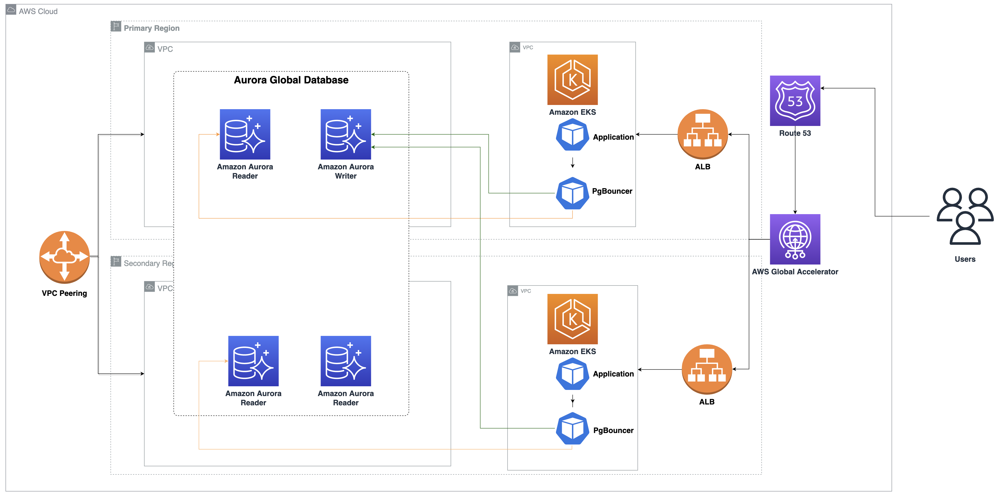
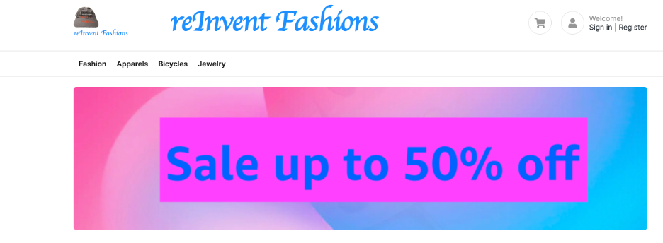

# Guidance for Multi-Region Application Data using Amazon Aurora on AWS

## Table of Content

List the top-level sections of the README template, along with a hyperlink to the specific section.

### Required

1. [Overview](#overview)
    - [Cost](#cost)
2. [Prerequisites](#prerequisites)
3. [Deployment Steps](#deployment-steps)
4. [Deployment Validation](#deployment-validation)
5. [Running the Guidance](#running-the-guidance)
7. [Cleanup](#cleanup)

## Overview

AWS offers a breadth and depth of services that helps you run and scale your critical workloads in multiple Regions on AWS’ global footprint. Whether you need a multi-Region architecture to support disaster recovery or bring your applications and the backend database into close proximity to your customers to reduce latency, AWS gives you the building blocks to improve your application availability, reliability, and latency. In this guidance, we show you how you can use Amazon Elastic Kubernetes Service (Amazon EKS) to run your applications in multiple Regions. We use Amazon Aurora Global Database spanning multiple Regions as the persistent transaction data store, and AWS Global Accelerator to distribute traffic between Regions.

We configure both regions to be active-active using the local read and global write design pattern. We start by creating an [Amazon EKS](https://aws.amazon.com/eks/) cluster and [Aurora Global Database](https://aws.amazon.com/rds/aurora/global-database/) with PostgreSQL compatibility in regions `us-east-2` and `us-west-2`. We use [PgBouncer](https://www.pgbouncer.org/features.html) for database connection pooling, which is an open-source connection pooling solution for PostgreSQL. We also implement a workflow using [Amazon EventBridge](https://aws.amazon.com/eventbridge/) for PgBouncer to handle planned Aurora Global Database failover. We then deploy the application stack, which includes stateless containerized applications on Amazon EKS clusters in both regions. We then expose the application endpoint using an [Application Load Balancer](https://docs.aws.amazon.com/elasticloadbalancing/latest/application/introduction.html) in the respective Regions. Finally, we configure [AWS Global Accelerator](https://aws.amazon.com/global-accelerator) for the Load Balancers as endpoints



### Cost

You will need to pay for the AWS services used while running this guidance.

For cost management, we recommend creating a budget through AWS Cost Explorer. Prices are subject to change. For more details, refer to the pricing pages for each AWS service used in this guidance.

1. AWS Lambda
    
    Memory allocation: 128MB 
    Price: $0.20 per 1 million requests (`us-east-2` and `us-west-2` Regions)

2. Amazon Aurora

    Instance price: $0.08/hour for an average usage (`us-east-2` and `us-west-2` Regions)
    Storage price: $0.10 per GB-month (`us-east-2` and `us-west-2` Regions)
    I/O price:  $0.20 per 1 million requests  (`us-east-2` and `us-west-2` Regions)
    Global Database Replication price: $0.20 per million replicated write I/Os (`us-east-2` and `us-west-2` Regions)
    
3. Amazon Kubernetes Service

    EKS Cluster price: $0.10 USD per hour for an average usage (`us-east-2` and `us-west-2` Regions)

4. Amazon EC2

    Instance price: $0.04/hour for an average usage (`us-east-2` and `us-west-2` Regions)

5. Application Load Balancer

    Price: $0.02 for an average usage per ALB per hour + $0.008 an average usage per LCU-hour

6. AWS Global Accelerator

    Price: $0.015 for an average usage per GB

7. Amazon CloudWatch Logs

    Price: $1.53/GB (`us-east-2`, 'us-west-2` Regions)
    Assumption: 1GB/month of log data generated

### Total monthly estimated cost for all services

The following table provides a sample cost breakdown for deploying this Guidance with the default parameters in the `us-east-2` and `us-west-2` Regions for one month:

| AWS service  | Dimensions | Cost [USD] |
| ----------- | ------------ | ------------ |
| Amazon Aurora | 3 Instances, 1GiB Storage, 10 million IOPS, Global Database Replication per month  | $ 179 month |
| Amazon EKS | 2 EKS Clusters in each Region | $ 146 per month |
| Amazon EC2 | 2 t3.medium nodes in EKS nodegroup in each Region | $ 117 per month |
| AWS Global Accelerator | 10 GiB data transfer | 0.15 per month |
| AWS CloudWatch Logs | 1GB/month of log data generated | $1.53 per month |
| AWS Lambda | 1 million requests in each Region | 0.40 per month |
| Application Load Balancer | 10GiB per month ec2 targets processed bytes, 1.67 per second average number of new connections, 300 seconds average connection duration | $ 1.95 per month |

Total estimated cost: $ 446.02

Note: This amount is an estimate and does not include the costs such as data transfer costs. The actual cost may vary depending on your usage and provisioned services.


## Prerequisites

To follow along with this tutorial, you should have the following prerequisites:

- An [AWS account](https://aws.amazon.com/account/)
- [Git](https://git-scm.com/downloads).
- [AWS Command Line Interface (CLI)](https://aws.amazon.com/cli/) version 2.9 or later installed and [configured](https://docs.aws.amazon.com/cli/latest/userguide/cli-chap-configure.html) on your workstation
- Permission to create AWS resources (e.g., IAM Roles, IAM policies, Amazon EC2 instances, AWS Cloud9, Amazon Aurora DB clusters, and Amazon EKS clusters)

## Deployment Steps

1. To deploy the solution, complete the following steps: First, we launch AWS CloudFormation stacks to setup the following resources in the `us-east-2` and `us-west-2` Regions using [AWS CloudShell](https://aws.amazon.com/cloudshell/):

   - An Amazon Aurora database cluster with a writer node in `us-east-2`.
   - An Amazon Aurora global database with the secondary Region in `us-west-2`.
   - VPC peering between `us-east-2` and `us-west-2` to help our applications securely connect to the Amazon Aurora PostgreSQL-Compatible Edition database across Regions. You can also connect applications over private network using AWS Transit Gateway for intra-Region VPC peering. Please review Building a global network using AWS Transit Gateway Inter-Region peering for additional details. We use VPC peering for keeping this solution simple.Run the following from AWS CloudShell in `us-east-2` Region to set AWS access credentials, clone the [git repository](https://github.com/aws-solutions-library-samples/guidance-for-multi-region-application-data-using-amazon-aurora) and launch AWS CloudFormation stacks. This step may take approximately 30 minutes.

   ```shell
   # Set REGION1 to source Region
   # Set REGION2 to target Region
   export AWS_DEFAULT_REGION=us-east-2
   export AWS_REGION=us-east-2
   export REGION1=us-east-2
   export REGION2=us-west-2
   git clone https://github.com/aws-solutions-library-samples/guidance-for-multi-region-application-data-using-amazon-aurora.git eks-aurora-global-database
   cd eks-aurora-global-database
   ./auroraglobaldb_eks.sh setup_env
   ```

2. Next, run the following to get the AWS Cloud9 URL information from the CloudFormation templates from both Regions `us-east-2` and `us-west-2`:
   
   ```shell
   for region in "${REGION1}" "${REGION2}"; do 
     cft=$(aws cloudformation describe-stacks --stack-name EKSGDB1 --region $region --query 'Stacks[].Outputs[?(OutputKey == `Cloud9IDEURL`)][].{OutputValue:OutputValue}' --output text) 
     echo $region:  $cft 
   done
   ```
   
3. Connect to the AWS Cloud9 terminal through a web browser for each Region using the preceding URL from Step 2.

4. Run the following code from both AWS Cloud9 terminals in both Regions, one at a time, to deploy the following resources:
   - Amazon EKS clusters in both Regions
   - Cluster Autoscaler, Horizontal Pod Autoscaler and AWS Load Balancer Controller on Amazon EKS on both Regions.
  
   ```shell
   # Set REGION1 to source Region
   # Set REGION2 to target Region
   cd ~/environment/eks-aurora-global-database
   export REGION1=us-east-2
   export REGION2=us-west-2
   ./auroraglobaldb_eks.sh
   ```

5. Next, we deploy a PgBouncer database connection pooler and ClusterIP service for PgBouncer on Amazon EKS, and create a sample database schema on the Amazon Aurora PostgreSQL cluster. It also provisions retail application microservices to EKS clusters in us-east-2 and us-west-2. These micro services in both Regions use readers from local regional Aurora database clusters for reads for better performance.
   - Set up the PgBouncer database connection pooler deployment on Amazon EKS in both Regions.
   - Set up retail application deployments on Amazon EKS in both Regions.
   - Set up ClusterIP service for PgBouncer on Amazon EKS in both Regions.
   - Set up Ingress for retail application Pods on Amazon EKS in both Regions.
   - Set up an AWS Lambda function AuroraGDBPgbouncerUpdate on both Regions to synchronize PgBouncer configuration with the respective Aurora writer endpoint and reader endpoints.
   - Set up an Amazon EventBridge event rule AuroraGDBPgBouncerUpdate on the event bus default on both Regions on the event category global-failover (event ID RDS-EVENT-0185). The event rule uses the target as the Lambda function AuroraGDBPgbouncerUpdate to synchronize the PgBouncer configuration when the Amazon Aurora global database is failed over across Regions. Please review Building an event-driven application with Amazon EventBridge post on how to scale applications using event driven architecture.Run the following from both AWS Cloud9 terminals on Regions us-east-2 and us-west-2, one at a time:

   ```shell
   cd retailapp; make
   cd ..
   # Set REGION1 to source Region
   # Set REGION2 to target Region
   export REGION1=us-east-2
   export REGION2=us-west-2
   ./auroraglobaldb_eks.sh configure-retailapp
   ```

   The retail application deployment manifest consists of various microservices such as `webapp`, `product`, `order`, `user`, and `kart`. It deploys Kubernetes services `ClusterIP` for internal microservices and a `NodePort` and `Ingress` for the external website-facing microservice. The `Ingress` creates internet facing `Application Load Balancer` for our retail website application using an [AWS Load Balancer controller](https://docs.aws.amazon.com/eks/latest/userguide/aws-load-balancer-controller.html).

6. Next, run the following code from both AWS Cloud9 terminals on Regions `us-east-2` and `us-west-2` to ensure all deployments and services are up and running:

   ```shell 
   kubectl get all -n retailapp
   kubectl get ingress -n retailapp
   ```

7. Run the following on both Regions `us-east-2` and `us-west-2` to verify the API health check using the `/healthcheck` call:

   ```shell 
   url=$(kubectl get ingress webapp -n retailapp -o jsonpath='{.status.loadBalancer.ingress[0].hostname}')
   curl $url/healthcheck
   ```
   The output should look like below:
   ```
   {
     "status": "success"
   }
   ``` 

### Configure AWS Global Accelerator

1. Run the following script on your AWS Cloud9 terminal on region `us-west-2`. The script configures AWS Global Accelerator and return DNS name of your accelerator:

   ```shell
   # Set REGION1 to source Region
   # Set REGION2 to target Region
   export REGION1=us-east-2
   export REGION2=us-west-2
   ./auroraglobaldb_eks.sh global-accelerator 
   ```

2. Next, you run the following API call apiproduct on AWS Cloud9 terminal on both Regions `us-east-2` and `us-west-2` using AWS Global Accelerator DNS name from the previous step (Step 1). The API call returns the IP address of the Aurora writer node, reader node, and the application locality. The call is routed to our retail application webapp microservice to the closest region. The application uses the PgBouncer database connection pooler for database connection scaling. PgBouncer is configured with two databases: one for connecting to the writer node, which is an Aurora cluster endpoint in the primary region `us-east-2`, and another one for the reader that connects to the Aurora reader endpoint in the local region that is local to the application. Run the following API call on your AWS Cloud9 terminal on `us-east-2`. The call is routed to the retail application webapp microservice on `us-east-2`:

   ```shell
   gurl=$(aws globalaccelerator list-accelerators --region $REGION2 --query 'Accelerators[0].DnsName' --output text)
   curl $gurl/apiproduct
   ```
   The output should look like below:
   ```
   {
     "Aurora": {
        "reader": {
           "inet_server_addr": "10.40.30.164" <---- Aurora Reader in region us-east-2
            },
        "writer": {
           "inet_server_addr": "10.40.30.164" <---- Aurora Writer in region us-east-2
           }
      },
     "Lab": "Amazon EKS & Aurora Global Database Workshop",
     "instanceId": "i-0c067696fdbe33e9a",
     "region": "us-east-2"                  <----- EKS/Container in region us-east-2
   }
   ```

3. Run the following API call on the AWS Cloud9 terminal on region `us-west-2`. The call is routed to the retail application webapp microservice on `us-west-2`:

   ```shell
   gurl=$(aws globalaccelerator list-accelerators --region $REGION2 --query 'Accelerators[0].DnsName' --output text)
   curl $gurl/apiproduct
   ```
   The output should look like below:
   ```
   {
   "Aurora": {
      "reader": {
         "inet_server_addr": "10.50.40.11"  <---- Aurora Reader in region us-west-2
       },
      "writer": {
         "inet_server_addr": "10.40.30.164" <---- Aurora Writer in region us-east-2
       }
     },
     "Lab": "Amazon EKS & Aurora Global Database Workshop",
     "instanceId": "i-023a7f839a2c302c7",
     "region": "us-west-2"                  <----- EKS/Container in region us-west-2
   }
   ```
   In this example, the API call returns the application region and Amazon Aurora database writer and local reader endpoints. You should see a response originating from the region closest to you. AWS Global Accelerator sends traffic to the Amazon EKS cluster in the nearest AWS Region.

4. Run the following API call on the AWS Cloud9 terminal on us-east-2 and us-west-2 to ensure that application works fine and is able to retrieve product information and create new orders:

   ```shell 
   kubectl exec -ti deployment/product-deployment -n retailapp -- curl http://product.retailapp.svc.cluster.local:8444/products/view?id=2
   
   kubectl exec -ti deployment/webapp -n retailapp -- bash
   curl --request POST --header "Content-type: application/json" --data '{"email": "test1@test1.com", "items": [{"order_id":100, "item_id": 2, "qty": 1, "unit_price": 42.95}]}' http://order.retailapp.svc.cluster.local:8448/order/add
   exit
   ```
   The output should look like below:

   ```
   {
   "product_items": [
     {
     "description": ..
     .....
     }]
   }
   ---
   {
   "order_details": {
     "email": "test1@test1.com",
     "items": [
       {
         "item_id": 2,
         "order_id": 100,
         "qty": 1,
         "unit_price": 42.95
        }
      ],
     "order_id": 4
     },
     "status_code": 200,
     "title": "Orders"
    }
   ```

5. Use a web browser such as Chrome and open the retail application interface using the AWS Global Accelerator DNS name (from Step 1).

   

   The retail application has been deployed to both Regions and is fully functional. We now perform scalability and disaster recovery tests.

## Deployment Validation

1. Check that the following CloudFormation stacks have been successfully created in the both source and target Regions `us-east-2` and `us-west-2`.

    - `EKSGDB1`
    - `EKSGDB2`
    - `auroragdbeks`

## Running the Guidance

### Application scalability test

To test for application scalability, we set up Horizontal Pod Autoscaler (HPA) for the retail application microservice deployment `webapp` on Amazon EKS and perform a synthetic load on the retail application using the Apache HTTP server benchmarking ([ab](https://httpd.apache.org/docs/2.4/programs/ab.html)) utility. The benchmark test uses 100 requests with 50 concurrent clients and runs for 300 seconds on our retail application website in us-east-2. This intense CPU stress test cause HPA to scale out application when its CPU threshold reach 50%.

1. Run the following on your AWS Cloud9 terminal on both `us-east-2` and `us-west-2` to create an auto scaler for the ReplicaSet `webapp`, with target CPU utilization set to 50% and the number of replicas between 2–20:

    ```shell
    kubectl autoscale deployment webapp --cpu-percent=50 --min=2 --max=20 -n retailapp
    ```

    The output should look like below:

    ```
    horizontalpodautoscaler.autoscaling/webapp autoscaled
    ```

2. Next, run the following on an AWS Cloud9 terminal on `us-east-2` to perform a stress test. Use two terminal windows on your AWS Cloud9 terminal on `us-east-2`: one to watch HPA and another to initiate a stress test. The HPA scales out webapp pods when its CPU threshold reaches 50% as per the configuration. It automatically scales back pods when the load subsides.

    Run the following on terminal 1:

    ```shell
    gurl=$(aws globalaccelerator list-accelerators --region $REGION2 --query 'Accelerators[0].DnsName' --output text)
    # Run the following from first terminal
    ab -c 50 -n 100 -t 300 ${gurl}/products/fashion/
    ```

    Run the following on terminal 2:

    ```shell
    kubectl get hpa -n retailapp -w
    # Press Ctrl+C to exit (after 5 minutes)
    ```

    The output should look like below on terminal 1:

    ```
    This is ApacheBench, Version 2.3 <$Revision: 1901567 $>
    Copyright 1996 Adam Twiss, Zeus Technology Ltd, http://www.zeustech.net/
    Licensed to The Apache Software Foundation, http://www.apache.org/Benchmarking a9d3278dd00f99a35.awsglobalaccelerator.com (be patient)
    Completed 5000 requests
    Completed 10000 requests
    ....
    ```

    The output should look like below on terminal 2:

    ```
    NAME     REFERENCE           TARGETS   MINPODS   MAXPODS   REPLICAS   AGE
    webapp   Deployment/webapp   2%/50%    2         20        2          21m
    webapp   Deployment/webapp   63%/50%   2         20        2          23m
    webapp   Deployment/webapp   305%/50%   2         20        3          23m
    webapp   Deployment/webapp   294%/50%   2         20        6          23m
    webapp   Deployment/webapp   25%/50%    2         20        12         23m
    webapp   Deployment/webapp   89%/50%    2         20        13         24m
    webapp   Deployment/webapp   171%/50%   2         20        13         24m
    ...
    webapp   Deployment/webapp   2%/50%     2         20        13         29m
    webapp   Deployment/webapp   2%/50%     2         20        2          29m
    ```

In this example, the auto scaler (HPA) scaled out `webapp` pods from 2 to 13 as load increased on the retail application. It automatically scaled back pods to two when the load subsided. To automatically scale your database for high load scenarios, you can also use Aurora features such as Amazon [Aurora Serverless v2](https://docs.aws.amazon.com/AmazonRDS/latest/AuroraUserGuide/aurora-serverless-v2.html) for on-demand and automatic vertical scaling, and [Auto Scaling](https://docs.aws.amazon.com/AmazonRDS/latest/AuroraUserGuide/Aurora.Integrating.AutoScaling.html) with Amazon Aurora replicas to scale out Amazon Aurora reader nodes, as the application increases load on the database. To automatically scale your EKS Cluster under high load scenarios, you can use [Cluster Autoscaler](https://github.com/kubernetes/autoscaler), [Karpenter](https://karpenter.sh/).

### Database cluster cross Region switchover test

1. Run the following on your AWS Cloud9 terminal on us-east-2 to perform an Amazon Aurora global database switchover:
   
   ```shell
   FAILARN=$(aws rds describe-global-clusters --query 'GlobalClusters[?(GlobalClusterIdentifier == `agdbtest`)].GlobalClusterMembers[]' | jq '.[] | select(.IsWriter == false) | .DBClusterArn'| sed -e 's/"//g')
   PRIMARN=$(aws rds describe-global-clusters --query 'GlobalClusters[?(GlobalClusterIdentifier == `agdbtest`)].GlobalClusterMembers[]' | jq '.[] | select(.IsWriter == true) | .DBClusterArn'| sed -e 's/"//g')
   PRIMREGION=`echo $PRIMARN | awk -F: '{print $4}'`
   GLCLUIDE=agdbtest
   aws rds switchover-global-cluster \
     --region $PRIMREGION \
     --global-cluster-identifier agdbtest \
     --target-db-cluster-identifier ${FAILARN}
   ```
   
   The output should look like below:
   ```
   {
      "GlobalCluster": {
      "GlobalClusterIdentifier": "agdbtest",
      "GlobalClusterResourceId": "cluster-433c4f5b8c6d365b",
      "GlobalClusterArn": "arn:aws:rds::xxxxxxx:global-cluster:agdbtest",
      "Status": "switching-over",
      "Engine": "aurora-postgresql",
      .....
      "FailoverState": {
         "Status": "pending",
         "FromDbClusterArn": "arn:aws:rds:us-east-2:xxxxxx:cluster:adbtest",
         "ToDbClusterArn": "arn:aws:rds:us-west-2:xxxxxx:cluster:adbtest"
        }
      }
   }
   ```
   Next, make sure that the global database failover is completed successfully by checking the status.

2. Run the following on your AWS Cloud9 terminal on `us-east-2` to check the database events. Ensure that the switchover has been completed successfully.

   ```shell
    aws rds describe-events --source-identifier adbtest --source-type db-cluster --query 'Events[?(EventCategories == [`global-failover`])]'
   ```

3. Next, ensure that the PgBouncer configuration in Amazon EKS on both Regions has been synchronized using the event rule and Lambda function. You should see Amazon Aurora cluster endpoint from `us-west-2` region as host entry for gdbdemo database in pgbouncer.ini.Run the following on your AWS Cloud9 terminal on `us-east-2` to get the current cluster endpoint (writer node):

   ```shell
   aws rds describe-global-clusters --query 'GlobalClusters[?(GlobalClusterIdentifier == `agdbtest`)].GlobalClusterMembers[]' | jq '.[] | select(.IsWriter == true) | .DBClusterArn'
   ```

4. Run the following on your AWS Cloud9 terminal on both `us-east-2` and `us-west-2` to check PgBouncer configuration (Use Global Accelerator DNS name from Step 1 for `/apiproduct` API call):

   ```shell
    kubectl exec -ti deployment/pgbouncer-deployment -n retailapp -- egrep ^gdbdemo /etc/pgbouncer/pgbouncer.ini
    curl $gurl/apiproduct
   ```
   The output should look like below:
   ```
   gdbdemo = host=adbtest.cluster-cg2psgfrllkh.us-west-2.rds.amazonaws.com port=5432 dbname=eksgdbdemo
   gdbdemo-ro = host=adbtest.cluster-ro-cqy9igkqggyn.us-east-2.rds.amazonaws.com port=5432 dbname=eksgdbdemo
   {
      "Aurora": {
        "reader": {
           "inet_server_addr": "10.40.30.164"
          },
        "writer": {
          "inet_server_addr": "10.50.40.11" <---- Aurora Writer in region us-west-2
         }
      },
      "Lab": "DAT312 Workshop",
      "instanceId": "i-077460000094a5578",
      "region": "us-east-2"
   }
   ```
5. Run the following on your AWS Cloud9 terminal on both Regions to ensure that the application works fine and is able to retrieve product information and create new orders, and confirm that the application works following the role transition:
   
   ```
   kubectl exec -ti deployment/product-deployment -n retailapp -- curl http://product.retailapp.svc.cluster.local:8444/products/view?id=2
   kubectl exec -ti deployment/webapp -n retailapp -- bash
   curl --request POST --header "Content-type: application/json" --data '{"email": "test1@test1.com", "items": [{"order_id":100, "item_id": 2, "qty": 1, "unit_price": 42.95}]}' http://order.retailapp.svc.cluster.local:8448/order/add
   exit
   ```

In this example, the PgBouncer configuration has been automatically synchronized with new Amazon Aurora primary cluster endpoint following the Aurora global database failover. The database cluster role transition was transparent to our application and all the API calls to retail application works fine after the failover.

# Next Steps

For more information, refer to the following:

- *Scale applications using multi-Region Amazon EKS and Amazon Aurora Global Database* [part 1](https://aws.amazon.com/blogs/database/part-1-scale-applications-using-multi-region-amazon-eks-and-amazon-aurora-global-database/) & [part 2](https://aws.amazon.com/blogs/database/part-2-scale-applications-using-multi-region-amazon-eks-and-amazon-aurora-global-database/).

# Cleanup

1. To clean up your resources, run the following on your AWS Cloud9 terminal in `us-east-2` and `us-west-2` Regions:

   ```
   kubectl delete ingress,services,deployments,statefulsets -n retailapp --all
   kubectl delete ns retailapp --cascade=background
   export AWS_REGION=$(curl -s 169.254.169.254/latest/dynamic/instance-identity/document | jq -r '.region')
   eksctl delete iamserviceaccount --name aws-load-balancer-controller --cluster eksclu --namespace kube-system --region ${AWS_REGION}
   eksctl delete cluster --name eksclu -r ${AWS_REGION} --force -w
   ```

2. Run the following from AWS CloudShell in `us-west-2` Region:

   ```
   export AWS_DEFAULT_REGION=us-west-2 
   # Set REGION1 to source Region
   # Set REGION2 to target Region
   export REGION1=us-east-2
   export REGION2=us-west-2
   bash ./cleanup.sh
   ```

## License

This library is licensed under the MIT-0 License. See the LICENSE file.
